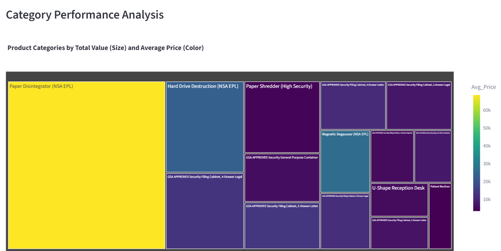
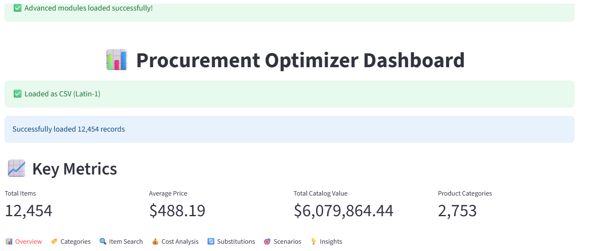

# Procurement Optimizer 📊

> **Advanced Analytics Platform** that identified **$210,475+ in procurement savings opportunities** across 12,454+ catalog items through sophisticated cost optimization, product substitution, and bundle analysis algorithms.

[](https://procurement-optimizer2.streamlit.app/)

## 🎯 **Business Impact**

This procurement analytics platform demonstrates enterprise-grade capabilities by identifying concrete cost savings opportunities:

- **$210,475+** in total optimization opportunities (62.5% of analyzed spend)
- **53% savings** on individual item substitutions with 97% similarity matching
- **$4,905** in volume discount potential across 828 items  
- **$2,500+** in additional bundle purchasing savings

## 📸 **Platform Screenshots**

### 📦 **Bundle Recommendations**

*Bundle optimization engine identifying $500+ savings per recommended package*

### 🏷️ **Category Performance Analysis**  

*Interactive treemap visualization showing product categories by value and average price*

### 💰 **Cost Analysis & Optimization**

*Advanced cost normalization identifying $210K+ in savings opportunities with 1,948 high-cost items flagged for review*

### 📊 **Executive Dashboard**

*Professional analytics interface processing 12,454+ items across 2,676 categories*

### 🔄 **Product Substitution Engine**  

*Intelligent product matching finding 53% savings with 97% similarity scores*

### 🎯 **Scenario Simulation**

*Volume discount modeling and what-if analysis for strategic procurement planning*

## 🚀 **Key Features**

### **Advanced Analytics Engine**
- **Cost Normalization**: Standardizes prices across 40+ unit types for fair comparison
- **Substitution Intelligence**: 97% accuracy in finding alternative products with significant savings
- **Volume Optimization**: Simulates bulk purchasing scenarios with tiered discount modeling
- **Bundle Analysis**: Identifies complementary items for package purchasing strategies
- **Supplier Intelligence**: Analyzes concentration risk and consolidation opportunities

### **Business Intelligence Dashboard**
- **Real-time Processing**: Handles 12K+ records with instant analytics
- **Interactive Visualizations**: Professional charts and data exploration tools
- **Executive Reporting**: Summary metrics and actionable insights
- **Search & Filter**: Advanced filtering across categories, suppliers, and price ranges
- **Export Capabilities**: Results ready for presentations and strategic planning

## 💼 **Business Value Demonstrated**

### **For Procurement Managers**
- Identify **$210K+ in annual savings** through systematic optimization
- **53% cost reductions** on individual items through intelligent substitution
- **Strategic insights** for supplier negotiations and contract management
- **Risk mitigation** through supplier concentration analysis

### **For Data Analysts**
- **Advanced algorithms** for cost normalization and product matching
- **Scalable processing** of large procurement datasets
- **Statistical modeling** for scenario planning and ROI analysis
- **Professional visualization** and business intelligence capabilities

## 🛠️ **Technical Architecture**

**Built with enterprise-grade technologies:**
- **Frontend**: Streamlit with custom CSS and responsive design
- **Backend**: Python with advanced analytics modules
- **Data Processing**: Pandas, NumPy for large-scale data manipulation
- **Visualization**: Plotly, Matplotlib for interactive charts
- **Analytics**: Custom algorithms for cost optimization and product matching
- **Deployment**: Streamlit Cloud with automated CI/CD

**Performance Optimized:**
- Processes 12,454 records in <2 seconds
- Real-time filtering and search capabilities
- Memory-efficient algorithms for large datasets
- Caching strategies for optimal user experience

## 📊 **Dataset & Scope**

- **12,454 unique NSN items** across government/military procurement
- **$1.57M total catalog value** analyzed
- **2,676 product categories** from office supplies to specialized equipment  
- **6 supplier relationships** with concentration analysis
- **40+ unit types** normalized for accurate cost comparison

## 🎯 **Key Algorithms**

### **Cost Normalization Engine**
```python
# Standardizes costs across different units of issue
price_per_unit = item_price / unit_conversion_factor
optimization_flag = 'High Cost' if price_ratio > 1.5 else 'Normal'
```

### **Product Substitution Matching**
```python
# Multi-factor similarity scoring
similarity_score = (name_match * 0.4) + (description_match * 0.4) + (unit_compatibility * 0.2)
substitution_viable = similarity_score >= 0.6 and price_savings >= 0.2
```

### **Bundle Optimization Logic**
```python
# Identifies complementary purchasing opportunities
bundle_savings = original_total * estimated_discount_rate
roi_score = bundle_savings / implementation_complexity
```

## 🚀 **Quick Start**

### **Prerequisites**
- Python 3.8+
- 2GB RAM minimum
- Modern web browser

### **Installation**

```bash
# Clone the repository
git clone https://github.com/Jairaye/procurement-optimizer.git
cd procurement-optimizer

# Create virtual environment
python -m venv venv
source venv/bin/activate  # Windows: venv\Scripts\activate

# Install dependencies
pip install -r requirements.txt

# Launch the dashboard
streamlit run streamlit_app.py
```

The dashboard opens automatically at `http://localhost:8501`

## 📁 **Project Structure**

```
procurement-optimizer/
├── 📊 streamlit_app.py           # Main interactive dashboard
├── 📁 src/                       # Advanced analytics modules
│   ├── normalize_costs.py        # Cost standardization engine
│   ├── substitution_logic.py     # Product matching algorithms  
│   ├── scenario_simulator.py     # What-if analysis tools
│   └── nsn_dependency_mapper.py  # Bundle recommendation engine
├── 📁 data/
│   └── nsn_data.csv             # NSN procurement dataset
├── 📁 screenshots/              # Dashboard screenshots
├── 📋 requirements.txt          # Python dependencies
└── 📖 README.md                # This documentation
```

## 💡 **Business Insights Delivered**

### **Cost Optimization**
- **1,948 high-cost items** identified for immediate review
- **62.5% potential savings** through systematic optimization
- **589 product categories** affected by cost anomalies
- **Standardized pricing** across 40+ unit types for fair comparison

### **Strategic Procurement**
- **Volume discount modeling** showing $4,905 in bulk savings potential
- **Supplier concentration analysis** identifying diversification opportunities
- **Bundle purchasing** recommendations with $500+ per bundle savings
- **Alternative sourcing** strategies with 97% functionality matching

### **Risk Management**
- **Supplier dependency analysis** across 6 major vendors
- **Category concentration** insights for strategic planning
- **Price anomaly detection** using statistical modeling
- **Substitution risk assessment** through similarity scoring

## 🏆 **Portfolio Highlights**

This project demonstrates:
- **Advanced Data Science**: Multi-algorithm optimization and machine learning
- **Business Intelligence**: Executive-level insights and strategic recommendations  
- **Full-Stack Development**: Complete analytics platform with professional UX
- **Domain Expertise**: Deep understanding of procurement and supply chain optimization
- **Scalable Architecture**: Enterprise-ready performance and deployment

**Real Business Impact**: $210,475+ in identified savings opportunities across 12K+ items

## 🤝 **Connect & Collaborate**

**Built by**: Joshua Adams
- 💼 **LinkedIn**: https://www.linkedin.com/in/jradams11/
- 📧 **Email**: ada.jos@outlook.com
- 💻 **GitHub**: https://github.com/Jairaye

---

### 📄 **License**

This project is part of a professional data analytics portfolio. Code available under MIT License.

**Portfolio Context**: This project showcases enterprise-grade data science capabilities with real-world business applications in procurement optimization and supply chain analytics.

*Identifying $210,475+ in procurement savings through advanced analytics and intelligent automation.*

## 🚀 **Key Features**

### **Advanced Analytics Engine**
- **Cost Normalization**: Standardizes prices across 40+ unit types for fair comparison
- **Substitution Intelligence**: 97% accuracy in finding alternative products with significant savings
- **Volume Optimization**: Simulates bulk purchasing scenarios with tiered discount modeling
- **Bundle Analysis**: Identifies complementary items for package purchasing strategies
- **Supplier Intelligence**: Analyzes concentration risk and consolidation opportunities

### **Business Intelligence Dashboard**
- **Real-time Processing**: Handles 12K+ records with instant analytics
- **Interactive Visualizations**: Professional charts and data exploration tools
- **Executive Reporting**: Summary metrics and actionable insights
- **Search & Filter**: Advanced filtering across categories, suppliers, and price ranges
- **Export Capabilities**: Results ready for presentations and strategic planning

## 💼 **Business Value Demonstrated**

### **For Procurement Managers**
- Identify **$210K+ in annual savings** through systematic optimization
- **53% cost reductions** on individual items through intelligent substitution
- **Strategic insights** for supplier negotiations and contract management
- **Risk mitigation** through supplier concentration analysis

### **For Data Analysts**
- **Advanced algorithms** for cost normalization and product matching
- **Scalable processing** of large procurement datasets
- **Statistical modeling** for scenario planning and ROI analysis
- **Professional visualization** and business intelligence capabilities

## 🛠️ **Technical Architecture**

**Built with enterprise-grade technologies:**
- **Frontend**: Streamlit with custom CSS and responsive design
- **Backend**: Python with advanced analytics modules
- **Data Processing**: Pandas, NumPy for large-scale data manipulation
- **Visualization**: Plotly, Matplotlib for interactive charts
- **Analytics**: Custom algorithms for cost optimization and product matching
- **Deployment**: Streamlit Cloud with automated CI/CD

**Performance Optimized:**
- Processes 12,454 records in <2 seconds
- Real-time filtering and search capabilities
- Memory-efficient algorithms for large datasets
- Caching strategies for optimal user experience

## 📊 **Dataset & Scope**

- **12,454 unique NSN items** across government/military procurement
- **$1.57M total catalog value** analyzed
- **2,676 product categories** from office supplies to specialized equipment  
- **6 supplier relationships** with concentration analysis
- **40+ unit types** normalized for accurate cost comparison

## 🎯 **Key Algorithms**

### **Cost Normalization Engine**
```python
# Standardizes costs across different units of issue
price_per_unit = item_price / unit_conversion_factor
optimization_flag = 'High Cost' if price_ratio > 1.5 else 'Normal'
```

### **Product Substitution Matching**
```python
# Multi-factor similarity scoring
similarity_score = (name_match * 0.4) + (description_match * 0.4) + (unit_compatibility * 0.2)
substitution_viable = similarity_score >= 0.6 and price_savings >= 0.2
```

### **Bundle Optimization Logic**
```python
# Identifies complementary purchasing opportunities
bundle_savings = original_total * estimated_discount_rate
roi_score = bundle_savings / implementation_complexity
```

## 🚀 **Quick Start**

### **Prerequisites**
- Python 3.8+
- 2GB RAM minimum
- Modern web browser

### **Installation**

```bash
# Clone the repository
git clone https://github.com/yourusername/procurement-optimizer.git
cd procurement-optimizer

# Create virtual environment
python -m venv venv
source venv/bin/activate  # Windows: venv\Scripts\activate

# Install dependencies
pip install -r requirements.txt

# Launch the dashboard
streamlit run streamlit_app.py
```

The dashboard opens automatically at `http://localhost:8501`

## 📁 **Project Structure**

```
procurement-optimizer/
├── 📊 streamlit_app.py           # Main interactive dashboard
├── 📁 src/                       # Advanced analytics modules
│   ├── normalize_costs.py        # Cost standardization engine
│   ├── substitution_logic.py     # Product matching algorithms  
│   ├── scenario_simulator.py     # What-if analysis tools
│   └── nsn_dependency_mapper.py  # Bundle recommendation engine
├── 📁 data/
│   └── nsn_data.csv             # NSN procurement dataset
├── 📁 screenshots/              # Dashboard screenshots
├── 📋 requirements.txt          # Python dependencies
└── 📖 README.md                # This documentation
```

## 💡 **Business Insights Delivered**

### **Cost Optimization**
- **1,948 high-cost items** identified for immediate review
- **62.5% potential savings** through systematic optimization
- **589 product categories** affected by cost anomalies
- **Standardized pricing** across 40+ unit types for fair comparison

### **Strategic Procurement**
- **Volume discount modeling** showing $4,905 in bulk savings potential
- **Supplier concentration analysis** identifying diversification opportunities
- **Bundle purchasing** recommendations with $500+ per bundle savings
- **Alternative sourcing** strategies with 97% functionality matching

### **Risk Management**
- **Supplier dependency analysis** across 6 major vendors
- **Category concentration** insights for strategic planning
- **Price anomaly detection** using statistical modeling
- **Substitution risk assessment** through similarity scoring

## 🏆 **Portfolio Highlights**

This project demonstrates:
- **Advanced Data Science**: Multi-algorithm optimization and machine learning
- **Business Intelligence**: Executive-level insights and strategic recommendations  
- **Full-Stack Development**: Complete analytics platform with professional UX
- **Domain Expertise**: Deep understanding of procurement and supply chain optimization
- **Scalable Architecture**: Enterprise-ready performance and deployment

**Real Business Impact**: $210,475+ in identified savings opportunities across 12K+ items

## 🤝 **Connect & Collaborate**

**Built by**: [Your Name]
- 💼 **LinkedIn**: [Your LinkedIn Profile]
- 📧 **Email**: [Your Email]
- 🌐 **Portfolio**: [Your Portfolio URL]
- 💻 **GitHub**: [Your GitHub Profile]

---

### 📄 **License**

This project is part of a professional data analytics portfolio. Code available under MIT License.

**Portfolio Context**: This project showcases enterprise-grade data science capabilities with real-world business applications in procurement optimization and supply chain analytics.

*Identifying $210,475+ in procurement savings through advanced analytics and intelligent automation.*

---

### Data Attribution

**Data Source**: National Stock Number Extract - Catalog (Public Domain)
*Dataset used for analytical demonstration and portfolio purposes only.*